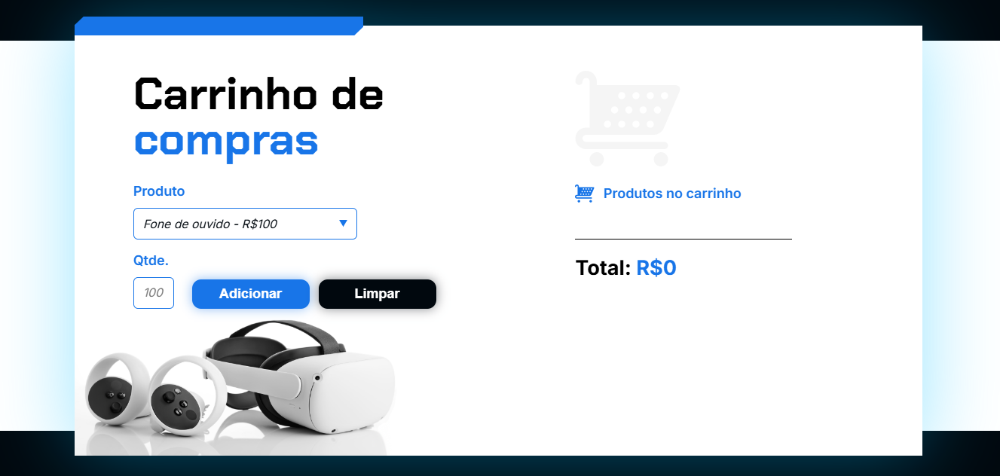
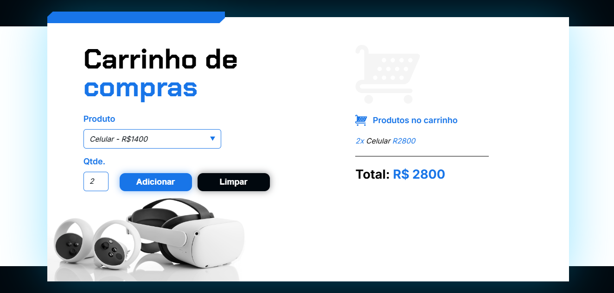

<h1 align="center" style="font-weight: bold;"> Carrinho de Compras 🛒 </h1>

    <b>Descrição do projeto:</b>
Este projeto é um carrinho de compras simples, onde os usuários podem visualizar e adicionar produtos a um carrinho virtual. A aplicação foi construída utilizando HTML, CSS e JavaScript. O carrinho também oferece a funcionalidade de limpar os itens, retornando o carrinho ao estado inicial. Este projeto foi desenvolvido para demonstrar como criar uma aplicação interativa de e-commerce básica, com foco no gerenciamento de produtos e no cálculo dinâmico de preços com JavaScript.

     <a href="https://carrinho-de-compras-uljm.vercel.app/">📱 Visite o projeto</a>

<h2 id="layout">🎨 Layout</h2>

    

 
    

<h2 id="technologies">💻 Tecnologias</h2>

- HTML
- CSS
- JAVA SCRIPT
- FRAMEWORKS

<h2 id="started">🚀 Começando</h2>

<h3>Pré Requisitos</h3>

- [HTML](https://github.com/)
- [CSS](https://github.com)
- [JAVA SCRIPT](https://github.com)
- [FRAMEWORK](https://github.com)
- [GITHUB](https://github.com)
- [VISUAL STUDIO CODE](https://github.com)
